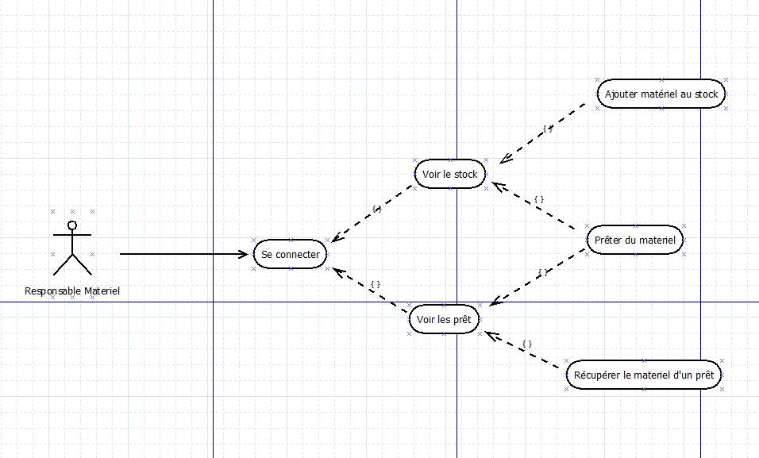
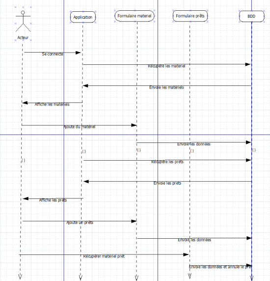
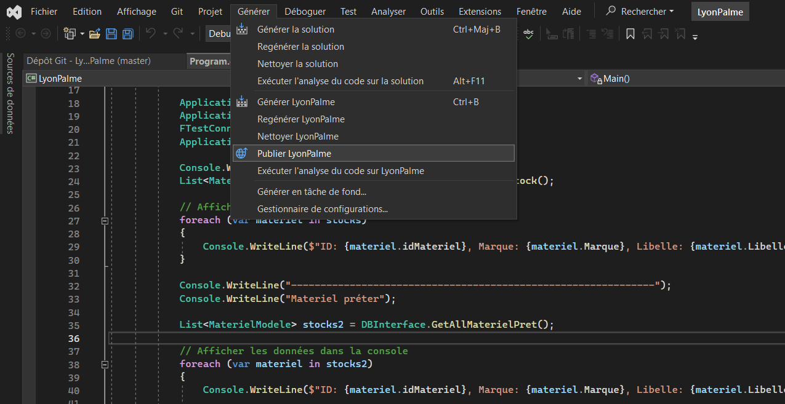

# Application "Gestion Matériel" pour **Lyon Palme**

## Sommaire

- [Description](#description)
- [Diagramme de cas](#cas)
- [Diagramme de séquence](#séquence)
- [Technologies utilisées](#technologies)
- [Prérequis](#prérequis)
- [Installation](#installation)
- [Utilisation](#utilisation)

## Description <a id="description"></a>

Le club « Lyon Palme » est une association sportive de nage avec palme : monopalme ou bi-palmes. Il compte une quarantaine d’adhérents, son siège est à Saint Fons.

Notre application Gestion Matériel permets de gérer le matériel du club. Seul le responsable matériel y a accès afin de pouvoir ajouter du stock, ajouter et retirer un prêt, visualiser les prêts, le stock et les nageurs.

## Diagramme de cas d'utilisation <a id="cas"></a>



## Diagramme de séquence <a id="séquence"></a>



## Technologies utilisées <a id="technologies"></a>

| Ressources | Description |
| ------ | ------ |
| Gitlab | Plateforme de développement collaborative |
| C# | Langage de programmation |
| SQL Server | Système de gestion de base de données |
| Windows Forms | Interface graphique pour la création des formulaires |

## Prérequis <a id="prérequis"></a>

Pour veiller au bon déroulement de l'application, il faut d'abord vous assurer que vous êtes connecté sur le réseau de l'établissement à l'aide d'un VPN si nécessaire afin d'accéder à la base de données et au projet sur Gitlab.

## Installation <a id="installation"></a>


1. Cloner le dépôt sur Gitlab
2. Ouvrir le projet sur Visual Studio
3. Supprimer le fichier App.config actuel, puis recréez en un contenant ce code afin d'effectuer la connexion à la base de données :

```xml
<?xml version="1.0" encoding="utf-8" ?>
<configuration>
	<startup>
		<supportedRuntime version="v4.0" sku=".NETFramework,Version=v4.7.2" />
	</startup>
	<connectionStrings>
		<add name="sqlserver_lyonpalme" connectionString="Data Source=192.168.100.236;Initial Catalog=raniazeramdini;User ID=CBrania;Password=@pp|iKT1ON!" providerName="System.Data.SqlClient" />
	</connectionStrings>
	<runtime>
		<assemblyBinding xmlns="urn:schemas-microsoft-com:asm.v1">
			<dependentAssembly>
				<assemblyIdentity name="System.Runtime.CompilerServices.Unsafe" publicKeyToken="b03f5f7f11d50a3a" culture="neutral" />
				<bindingRedirect oldVersion="0.0.0.0-6.0.0.0" newVersion="6.0.0.0" />
			</dependentAssembly>
			<dependentAssembly>
				<assemblyIdentity name="Newtonsoft.Json" publicKeyToken="30ad4fe6b2a6aeed" culture="neutral" />
				<bindingRedirect oldVersion="0.0.0.0-13.0.0.0" newVersion="13.0.0.0" />
			</dependentAssembly>
		</assemblyBinding>
	</runtime>
</configuration>
```

4. Pour créer un fichier exécutable de l'application, il vous faut aller dans l'onglet "générer" puis cliquez sur "Publier LyonPalme" comme ci-dessous.



Choisissez l'emplacement de votre exécutable puis vous pouvez cliquer sur "Terminer".

Vous pouvez cliquer sur l'exécutable qui s'est généré à votre emplacement puis "Installer" et votre application est prête à être lancé.

5. Afin de vous connecter à l'application, utilisez les identifiants suivant :

| Nom d'utilisateur | Mot de passe |
| ------ | ------ |
| admin | password |

## Utilisation <a id="utilisation"></a>

Une fois l'installation en place, vous pouvez vous connecter à l'application en utilisant les identifiants de l'administrateur qui s'occupe de la gestion du matériel du club. Vous pourrez donc y retrouver :
- l'affichage du stock de matériel
- l'ajout d'un prêt
- l'ajout du stock de matériel
- la récupération de prêts
